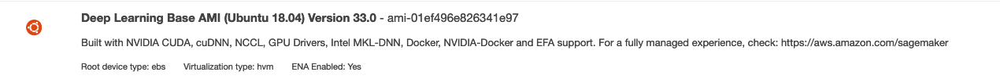
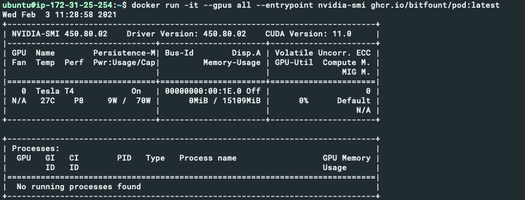

# docker-images
Information &amp; Licensing details for our public docker images

## License

The license for this software is available in the `LICENSE.md` file.
This can be found in the Github Repository, as well as inside the Docker image.

## Using the Docker images

Our Pod (Process Of Data) docker image is available via Github Container Registry: `ghcr.io/bitfount/pod:stable`

If you have any problems with any of the steps in this README then feel free to reach out to us.

## Providing the Config & Data
The image requires a valid `config.yaml` file to be provided to them,
by default they will try to load the file from `/mount/config/config.yaml` inside the docker container.

You can use the provided docker compose file by storing your config at `~/.bitfount_dev/docker/config.yaml` and running `docker compose up pod`.

Alternatively you could copy a config file into a stopped container using [docker cp](https://docs.docker.com/engine/reference/commandline/cp/).

**If you're using a CSV data source** then you'll also need to mount your data to the container,
this will need to be mounted at the path specified in your config, for simplicity it's easiest
put your config and your CSV in the same directory and then mount it to the container. 
For example you could provide it at `~/.bitfount_dev/docker/data.csv`.

## Starting the Pod
Once your container is running you will need to check the logs and complete the login step,
allowing your container to authenticate with Bitfount.
The process is the same as when running locally (e.g. the tutorials),
except that we can't open the login page automatically for you.

You can also use API keys in the `config.yaml` which will enable the pod to run indefinitely.

## Running with GPU(s) (NVIDIA CUDA)
To run the pod with a GPU it's recommended to use a Deep Learning Image when provisioning your host machine.
If you are unable to use a cloud provider Deep Learning Image, then see the section below on Manual GPU Setup.

The image you choose needs to have the following:
- NVIDIA GPU Drivers
- NVIDIA CUDA (version 10.2)
- [Nvidia Container Toolkit](https://docs.nvidia.com/datacenter/cloud-native/container-toolkit/install-guide.html#setting-up-nvidia-container-toolkit)
- [Docker](https://docs.docker.com/engine/install/)

You can check if the Nvidia Container Toolkit is installed by running:
```bash
which nvidia-container-runtime-hook
```
If a path is shown then it is installed.

You can also check that CUDA is installed and set up correctly by running:
```bash
nvidia-smi
```
If it's installed correctly then you will see the details of your GPU.

Docker and the nvidia container toolkit are easy to install if they are missing, just follow the steps in the links above.

Here's an example of a suitable image provided by AWS:


Once you've provisioned your machine you can run the `gpu` pod with the entrypoint set to `nvidia-smi` to ensure that it's available inside the container:
```
docker compose up gpu-checker
```

The result should look something like this:


If that's all working then you can run the pod with GPU access:
```bash
docker compose up gpu-pod
```


### Manual GPU Setup
If you are unable to use an image which already has NVIDIA CUDA set up then [this guide](https://docs.nvidia.com/datacenter/cloud-native/container-toolkit/install-guide.html#pre-requisites)
has information on how to install all of the pre-requisites on a wide variety of Operating Systems. 
You should only need the 'Installation Guide', but sections of the 'User Guide' may be useful for debugging or improving your understanding.

## Viewing logs
The logs are streamed to stdout and stderr by the application running inside the docker container.
If you're running the container detached (recommended) then these can be viewed directly using `docker logs` (see [docker's documentation](https://docs.docker.com/engine/reference/commandline/logs/)),
or using the tool that you normally use to view Docker container logs.

If using docker logs, run `docker ps` to find the name of your `ghcr.io/bitfount/pod` container, 
or use the long ID string produced when you ran your container,
 then run `docker logs -f <container name>`.
`-f` will follow the logs as they are generated, you can stop viewing them using `CTRL+C`.